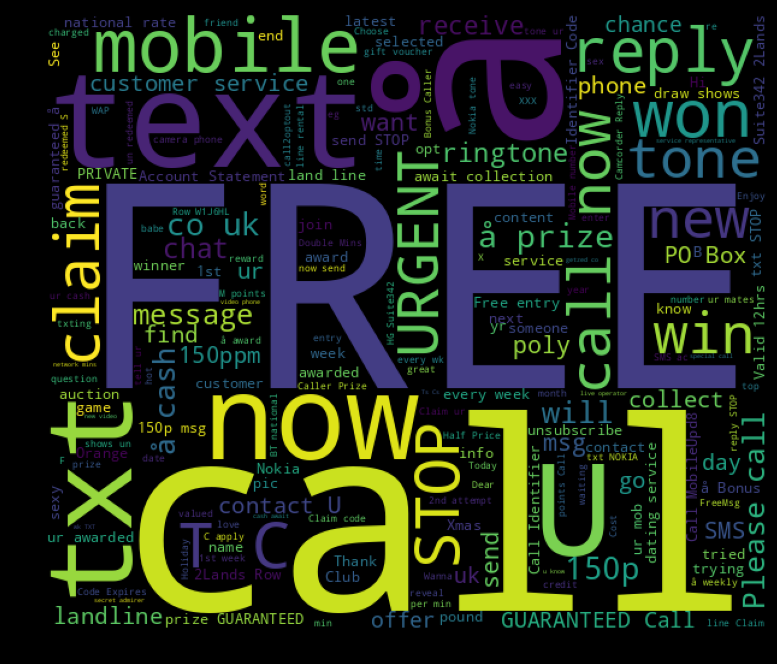

# SMS Spam Detection Classification Model

## Overview
This project presents an SMS Spam Detection model leveraging the Bag of Words (BoW) technique and advanced machine learning algorithms to effectively classify messages as spam or ham (non-spam). The model is designed to process and analyze text data, transforming it into a structured format that enhances the accuracy and reliability of spam detection systems.

## Features
- **High Accuracy:** Achieved 98.39% accuracy with the Naive Bayes classifier and 97.76% with Logistic Regression, showcasing the model's robustness in identifying spam messages.
- **Data Preprocessing:** Utilizes a comprehensive text preprocessing pipeline including tokenization, stopword removal, and TF-IDF transformation to convert SMS data into numerical vectors suitable for machine learning.
- **Machine Learning Models:** Implements popular algorithms such as Naive Bayes and Logistic Regression, providing comparative insights into their performance on the task of spam detection.
- **Visualization:** Includes a WordCloud visualization of common spam keywords, offering a visual understanding of the text patterns that differentiate spam from legitimate messages.

## WordCloud Visualization
The WordCloud image below highlights common keywords found in spam messages. This visualization provides insight into the frequent terms that contribute to spam classification.

## Technologies Used
- **Python Libraries:** Utilizes powerful Python libraries including NLTK for natural language processing, spaCy for advanced text handling, scikit-learn for machine learning, pandas for data manipulation, and NumPy for numerical operations.

## Usage
1. Prepare your dataset in the specified format.
2. Run the preprocessing script to clean and transform the data.
3. Train the model using the provided scripts and evaluate its performance.
4. Use the trained model to predict and classify new SMS messages.

## Future Enhancements
- Explore more sophisticated text representation techniques such as word embeddings.
- Implement ensemble methods to further improve classification accuracy.
- Expand the dataset to include diverse messages from various languages and regions for broader applicability.
